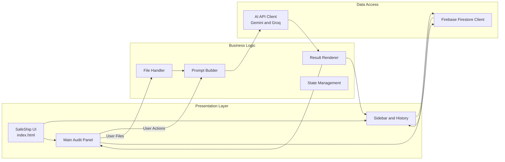
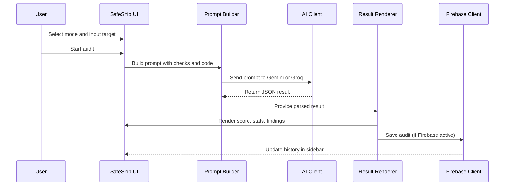
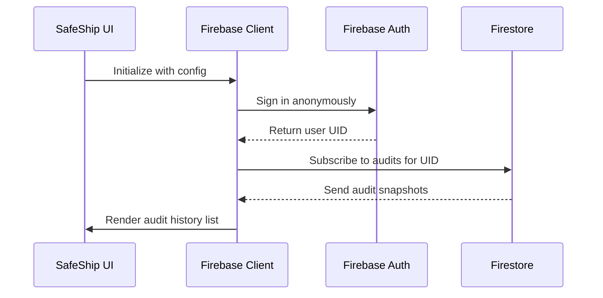

# SafeShip — Neural Trace Engine

## Overview 🚀

SafeShip is a fully client-side, AI-powered security auditing tool delivered as a single HTML file. It allows developers, security researchers, and students to analyze URLs, uploaded code files, or pasted snippets directly in the browser. The app uses Google Gemini as the primary AI engine, with Groq LLaMA as an automatic fallback. When Firebase is configured, SafeShip also persists audit history per anonymous user session.

---

## Key Features

- **Three audit modes** in one page:
  - URL Probe
  - SAST Audit (file upload)
  - Paste Code audit
- **AI-backed analysis** using:
  - Google Gemini `gemini-2.5-flash-preview-09-2025`
  - Groq `llama-3.3-70b-versatile` fallback
- **Rich results UI**:
  - Animated score ring
  - Severity stats and filters
  - Collapsible finding cards with CWE, impact, and fixes
- **Cloud history (optional)**:
  - Firebase Auth (anonymous)
  - Firestore audit history per user
- **Zero backend servers**:
  - Entire app in `index.html`
  - Deployed via GitHub Pages
- **Companion CLI**:
  - `audit_engine.py` for terminal-based audits using Gemini

---

## Architecture Overview

This diagram shows how the UI, business logic, and external services interact.



---

## Repository Structure

| File                        | Description                                                                                  |
|-----------------------------|----------------------------------------------------------------------------------------------|
| `index.html`               | Single-page web app with UI, logic, styling, AI calls, and Firebase integration             |
| `.github/workflows/deploy.yml` | GitHub Actions workflow for secret injection and GitHub Pages deployment              |
| `audit_engine.py`          | Python CLI version of the SafeShip SAST engine using Gemini                                 |
| `.gitignore`               | Ignore rules for environment files, Python cache, editor configs, and build artifacts       |

---

## Web App — `index.html`

### Overview

The web application lives entirely in `index.html`. It defines the layout, custom styling, audit flows, AI prompt construction, Firebase integration, and rendering of results. It works fully in the browser, using placeholders for secrets that the deployment pipeline injects.

### Main UI Sections

- **Sidebar**
  - App logo and name: **SafeShip**
  - Navigation items: URL Probe, SAST Audit, Paste Code
  - Trace History list (real-time with Firebase)
  - Node ID card (anonymous Firebase UID when available)
  - Footer with copyright and GitHub link
- **Topbar**
  - Mode tabs mirroring sidebar navigation
  - Status pill with animated dot and label (e.g., Standby, Cloud Linked)
- **Content**
  - Tab panels for each audit mode
  - Shared results area (idle, loading, or results state)

---

### Audit Modes

#### URL Probe

- **Input:** Single URL string.
- **Controls:**
  - Text input for the target URL.
  - INITIATE button.
  - 12 toggleable check chips:
    - XSS Detection
    - SQL Injection
    - HTTP Headers
    - CSRF Risks
    - SSL/TLS Config
    - CORS Policy
    - Auth Weaknesses
    - Rate Limiting
    - Data Exposure
    - Path Traversal
    - SSRF Vectors
    - IDOR / BOLA
- **Behavior:**
  - `startAudit('url')` validates URL presence.
  - Builds a detailed prompt with selected checks.
  - Calls AI engine for a structured security assessment of the endpoint.

#### SAST Audit (File Upload)

- **Input:** One or more uploaded code files.
- **Controls:**
  - Language chips (single-select, default **Auto Detect**):
    - JavaScript, TypeScript, Python, PHP, Java, C#, Go, Ruby, Rust, Kotlin, Swift, C/C++, Solidity, Shell/Bash, SQL, Auto.
  - 12 SAST check chips (multi-select):
    - Hardcoded Secrets
    - Injection Flaws
    - Broken Auth
    - Weak Crypto
    - Insecure Deser
    - XXE Injection
    - SSTI / Template
    - RCE Vectors
    - Supply Chain
    - Buffer Overflow
    - Race Conditions
    - Logic Flaws
  - Drag-and-drop or click-to-upload dropzone.
  - List of selected files (chips).
  - ANALYZE CODE button (enabled when at least one file is loaded).
- **Behavior:**
  - Files read via `FileReader` into `window.SAFESHIP_CONTEXT.currentFiles`.
  - Prompt includes file names and code contents.
  - AI is instructed to apply language-specific SAST checks.

#### Paste Code

- **Input:** Code snippet pasted into textarea.
- **Controls:**
  - Language select dropdown (Auto + supported languages).
  - Multiline textarea for code.
  - Live character counter.
  - ANALYZE PASTE and CLEAR buttons.
- **Behavior:**
  - `startAudit('paste')` validates non-empty input.
  - Prompt includes pasted code and selected or auto-detected language context.

---

### State and Context

- **Global State:**

```js
window.SAFESHIP_CONTEXT = {
  db: null,
  auth: null,
  appId: 'safeship-trace-v7',
  user: null,
  history: [],
  currentFiles: [],
  sessionKeys: {
    gemini: getGeminiKey(),
    groq: getGroqKey()
  }
};
```

- **Runtime variables:**
  - `currentTab`: active UI tab (`url`, `code`, `paste`).
  - `activeFilter`: current findings filter (`all`, `critical`, etc.).
  - `lastResult`: last audit result object.

---

### Prompt Building

#### Function: `buildPrompt(mode)`

- **Modes:** `url`, `code`, `paste`.
- **Inputs:**
  - Active checks from containers `#urlChecks` or `#sastChecks`.
  - URL from `#urlInput`.
  - Files from `SAFESHIP_CONTEXT.currentFiles`.
  - Pasted code from `#pasteInput`.
  - Language selection from chips or dropdown.
- **Behavior:**
  - Collects selected check identifiers.
  - Builds a natural language description of required checks.
  - Appends strict JSON schema requirements for the response.
  - For code modes, includes language-specific guidance and full code.

---

### Result Schema

The prompt demands a JSON object with this structure:

```json
{
  "score": 0,
  "grade": "A",
  "summary": "string",
  "language": "string",
  "stats": {
    "critical": 0,
    "high": 0,
    "medium": 0,
    "low": 0,
    "info": 0
  },
  "findings": [
    {
      "title": "string",
      "severity": "critical",
      "category": "string",
      "description": "string",
      "location": "string",
      "impact": "string",
      "fix": "string",
      "cwe": "CWE-79"
    }
  ]
}
```

---

### Loading & UI States

- **Idle state (`#idleState`):**
  - Shown when no audit is running or displayed.
  - Displays “AWAITING SIGNAL”.
- **Loading state (`#loadingState`):**
  - Spinner and current phase label (`#loadingPhase`).
  - Step list from `LOADING_STEPS[mode]`:
    - URL: resolving endpoint, analyzing surface, running checks, compiling findings.
    - Code: parsing file structure, detecting language, running SAST engine, generating report.
    - Paste: parsing code, detecting language, analyzing vulnerabilities, compiling findings.
- **Results state (`#contentState`):**
  - Displayed by `renderResults`.

---

### Results Rendering

#### Function: `renderResults(data, filter = 'all')`

- **Displays:**
  - Circular SVG score ring:
    - Score 0–100.
    - Color based on score range:
      - ≥80: `#00ff88`
      - ≥60: `#ffb800`
      - ≥40: `#ff7b3b`
      - else: `#ff3b3b`
  - Grade and label:
    - Mapped by `getGradeLabel`:
      - A: Excellent
      - B: Good
      - C: Fair
      - D: Poor
      - F: Critical
  - Detected language and summary.
  - Action buttons:
    - New Audit
    - JSON export
    - Markdown export
  - Stats cards:
    - Critical, High, Medium, Low, Info, Total counts.
  - Filter bar:
    - Buttons for severities; `applyFilter` re-renders with filter.
  - Findings list:
    - Each finding is a collapsible card.
    - Severity-aware border and badge.
    - Location, description, impact section, and fix code snippet.
    - Toggle via `toggleFinding`.

---

### Export Functions

- **`exportJSON()`**
  - Serializes `lastResult` to pretty JSON.
  - Triggers download as `safeship-audit-<timestamp>.json`.
- **`exportMarkdown()`**
  - Builds markdown report:
    - Score, grade, target, language.
    - Summary.
    - Numbered findings with severity and CWE.
    - Impact and fix sections.
  - Triggers download as `safeship-report-<timestamp>.md`.

---

### History & Cloud Persistence

#### Firebase Initialization

- **Config sources:**
  - `INJECTED_FIREBASE` placeholder holds Firebase config object.
- **Setup:**
  - `initializeApp(config)` for Firebase app.
  - `getAuth(app)` and anonymous sign-in via `signInAnonymously`.
  - `getFirestore(app)` for Firestore client.
- **Status:**
  - `setStatus` updates status pill label and dot style.
  - Possible labels:
    - Connecting
    - Cloud Linked
    - DB Offline
    - Standalone
    - Neural Active
    - Groq Fallback
    - No Keys

#### Audit History

- **Path:** `artifacts/safeship-trace-v7/users/{uid}/audits`.
- **Functions:**
  - `loadHistory(userId)`:
    - Uses `onSnapshot` to listen for audit docs under user path.
    - Sorts by timestamp descending.
    - Stores array in `SAFESHIP_CONTEXT.history`.
    - Calls `renderHistory`.
  - `saveAuditToCloud(data)`:
    - Adds document under current user’s audits collection.
    - Appends `timestamp: serverTimestamp()`.
  - `deleteAudit(id)`:
    - Deletes a single audit document by id.

#### History Rendering

- **Function:** `renderHistory()`
- **Behavior:**
  - Shows “NO TRACES YET” when history is empty.
  - For each history item:
    - Displays score with color from `getScoreColor`.
    - Displays date converted from Firestore timestamp.
    - Shows target label.
    - Clicking item calls `renderResults` for stored result.
    - Delete button appears on hover and calls `deleteAudit`.

---

### AI Engine Integration

#### Key Selection

- **Helpers:**
  - `getGeminiKey()`:
    - Returns `INJECTED_GEMINI_KEY` if string is non-empty and not placeholder-like.
  - `getGroqKey()`:
    - Same logic for `INJECTED_GROQ_KEY`.
- **Session keys stored in:**
  - `SAFESHIP_CONTEXT.sessionKeys` with `gemini` and `groq`.

#### Call Orchestration

- **Function:** `callNeuralNode(prompt)`
- **Behavior:**
  - If Gemini key exists:
    - Calls `callGemini`.
    - If `callGemini` throws, falls back to `callGroq` if available.
  - If only Groq is available:
    - Calls `callGroq`.
  - If none:
    - Throws `Error('No API keys configured.')`.

---

### Gemini API Endpoint

#### Gemini — Generate Content (POST)

```api
{
  "title": "Gemini Security Audit",
  "description": "Performs a security audit via Gemini and returns a strict JSON object describing findings.",
  "method": "POST",
  "baseUrl": "https://generativelanguage.googleapis.com",
  "endpoint": "/v1beta/models/gemini-2.5-flash-preview-09-2025:generateContent?key={GEMINI_API_KEY}",
  "headers": [
    {
      "key": "Content-Type",
      "value": "application/json",
      "required": true
    }
  ],
  "queryParams": [],
  "pathParams": [],
  "bodyType": "json",
  "requestBody": "{\n  \"contents\": [\n    {\n      \"parts\": [\n        { \"text\": \"<prompt>\" }\n      ]\n    }\n  ],\n  \"generationConfig\": {\n    \"responseMimeType\": \"application/json\"\n  }\n}",
  "formData": [],
  "responses": {
    "200": {
      "description": "Successfully generated a JSON security report.",
      "body": "{\n  \"candidates\": [\n    {\n      \"content\": {\n        \"parts\": [\n          { \"text\": \"{\\\"score\\\": 80, \\\"grade\\\": \\\"A\\\", ...}\" }\n        ]\n      }\n    }\n  ]\n}"
    },
    "400": {
      "description": "Bad request with invalid parameters or prompt.",
      "body": "{\n  \"error\": { \"message\": \"Invalid request\" }\n}"
    }
  }
}
```

---

### Groq API Endpoint (Fallback)

#### Groq — Chat Completions (POST)

```api
{
  "title": "Groq Security Audit Fallback",
  "description": "Performs a security audit via Groq's LLaMA model with a JSON object response.",
  "method": "POST",
  "baseUrl": "https://api.groq.com",
  "endpoint": "/openai/v1/chat/completions",
  "headers": [
    {
      "key": "Authorization",
      "value": "Bearer {GROQ_API_KEY}",
      "required": true
    },
    {
      "key": "Content-Type",
      "value": "application/json",
      "required": true
    }
  ],
  "queryParams": [],
  "pathParams": [],
  "bodyType": "json",
  "requestBody": "{\n  \"model\": \"llama-3.3-70b-versatile\",\n  \"messages\": [\n    { \"role\": \"user\", \"content\": \"<prompt>\" }\n  ],\n  \"response_format\": { \"type\": \"json_object\" }\n}",
  "formData": [],
  "responses": {
    "200": {
      "description": "Successfully generated a JSON security report.",
      "body": "{\n  \"choices\": [\n    {\n      \"message\": {\n        \"content\": \"{\\\"score\\\": 75, \\\"grade\\\": \\\"B\\\", ...}\"\n      }\n    }\n  ]\n}"
    },
    "400": {
      "description": "Bad request with invalid parameters or prompt.",
      "body": "{\n  \"error\": { \"message\": \"Invalid request\" }\n}"
    }
  }
}
```

---

## Deployment Pipeline — `.github/workflows/deploy.yml`

### Overview

The GitHub Actions workflow automates building and deploying SafeShip to GitHub Pages. It injects AI keys and Firebase configuration into `index.html` at deployment time. This keeps secrets out of the source repository.

### Workflow Structure

- **Trigger:**
  - On `push` to `main` branch.
- **Permissions:**
  - `contents: write`
  - `pages: write`
  - `id-token: write`
- **Job:** `build-and-deploy`
  - Runs on `ubuntu-latest`.

### Steps

1. **Checkout Code**
   - Uses `actions/checkout@v4`.
2. **Inject Neural Secrets**
   - `shell: python`.
   - Reads environment variables:
     - `GEMINI_API_KEY`
     - `GROQ_API_KEY`
     - `FIREBASE_CONFIG`
   - Opens `index.html` and replaces placeholders:
     - `__GEMINI_API_KEY__`
     - `__GROQ_API_KEY__`
     - `__FIREBASE_CONFIG_JSON__`
   - Validates:
     - At least one of Gemini or Groq keys present.
   - Parses Firebase configuration:
     - Accepts JS object-style or strict JSON.
     - Normalizes keys and quotes with regex.
     - Outputs minified JSON object literal.
   - Logs:
     - Missing keys.
     - Successful injections.
     - Firebase parsing status.
3. **Deploy to GitHub Pages**
   - Uses `peaceiris/actions-gh-pages@v3`.
   - Publishes from `./`.
   - Uses `GITHUB_TOKEN` for authentication.
   - Sets commit author to `github-actions[bot]`.

---

## Python CLI Engine — `audit_engine.py`

### Overview

`audit_engine.py` is a command-line interface implementation of the SafeShip trace engine. It communicates with the same Gemini model and prints JSON reports to the terminal. It focuses on SAST scanning for code security issues.

### Class: `SafeShipEngine`

| Method                | Description                                                                 |
|-----------------------|-----------------------------------------------------------------------------|
| `__init__()`          | Loads `GEMINI_API_KEY` from environment and initializes model name.        |
| `audit_source(code)`  | Builds a SAST audit prompt and sends it to Gemini for analysis.            |
| `_call_neural_api(prompt)` | Sends HTTP POST request to Gemini API and parses JSON response.    |

#### Initialization

- **Environment variable:** `GEMINI_API_KEY`
- **Model:** `gemini-2.5-flash-preview-09-2025`
- If key is missing:
  - Prints critical error message.
  - Exits with `sys.exit(1)`.
- On success:
  - Prints handshake message with model name.

#### Prompt Behavior

- Detects:
  - Hardcoded secrets.
  - XSS.
  - SQL injection.
- Asks for strict JSON output:

```json
{
  "score": 0,
  "summary": "string",
  "findings": [
    {
      "title": "string",
      "severity": "string",
      "description": "string",
      "location": "string",
      "fix": "string"
    }
  ]
}
```

#### API Call Logic

- **Endpoint:**
  - `https://generativelanguage.googleapis.com/v1beta/models/{model}:generateContent?key={GEMINI_API_KEY}`
- **Payload:**

```python
payload = {
  "contents": [{"parts": [{"text": prompt}]}],
  "generationConfig": {
    "responseMimeType": "application/json"
  }
}
```

- **Response handling:**
  - On non-200 response:
    - Returns `{"error": "API Error <status>", "raw": "<body>"}`.
  - On success:
    - Parses JSON and then parses nested JSON string.
  - On exception:
    - Returns `{"error": "<exception message>"}`.

### CLI Usage

- **Command:**

```bash
python audit_engine.py <filepath_or_code_string>
```

- **Behavior:**
  - If `<filepath_or_code_string>` is a valid file:
    - Reads contents from file.
  - Otherwise:
    - Treats argument as raw code string.
  - Calls `audit_source` with code content.
  - Prints:

```text
[*] Initiating Trace for: <target>
=== NEURAL TELEMETRY REPORT ===
<pretty-printed JSON result>
```

- Without arguments:
  - Prints usage message:
    - `Usage: python audit_engine.py <filepath_or_code_string>`

---

## Flow Diagrams

### 1. End-to-End Audit Flow



### 2. Firebase Authentication and History Flow



---

## .gitignore

### Ignored Files and Directories

- **Environment and secrets:**
  - `.env`
- **Python cache:**
  - `pycache/`
  - `*.pyc`
  - `*.pyo`
  - `*.pyd`
- **Editor configuration:**
  - `.vscode/`
  - `.idea/`
- **Build artifacts:**
  - `dist/`
  - `build/`

---

## Contributor

- **Name:** Aviraj Salunkhe  
- **GitHub:** [https://github.com/avirajsalunkhe](https://github.com/avirajsalunkhe)


- **Name:** Sanket Pawar  
- **GitHub:** [https://github.com/avirajsalunkhe](https://github.com/sanketpawar2513)

